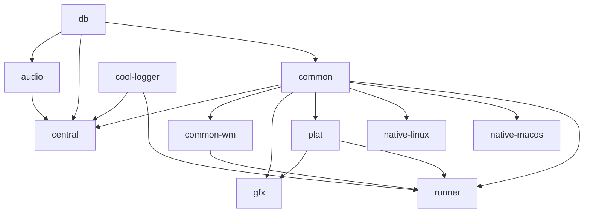

# architecture diagram
        

```mermaid
graph TD
   db --> audio
   db --> central
   db --> common
   common --> central
   common --> common-wm
   common --> gfx
   common --> plat
   common --> native-linux
   common --> native-macos
   common --> runner
   cool-logger --> central
   cool-logger --> runner
   audio --> central
   plat --> gfx
   plat --> runner
   common-wm --> runner

```
# thats it?        
    